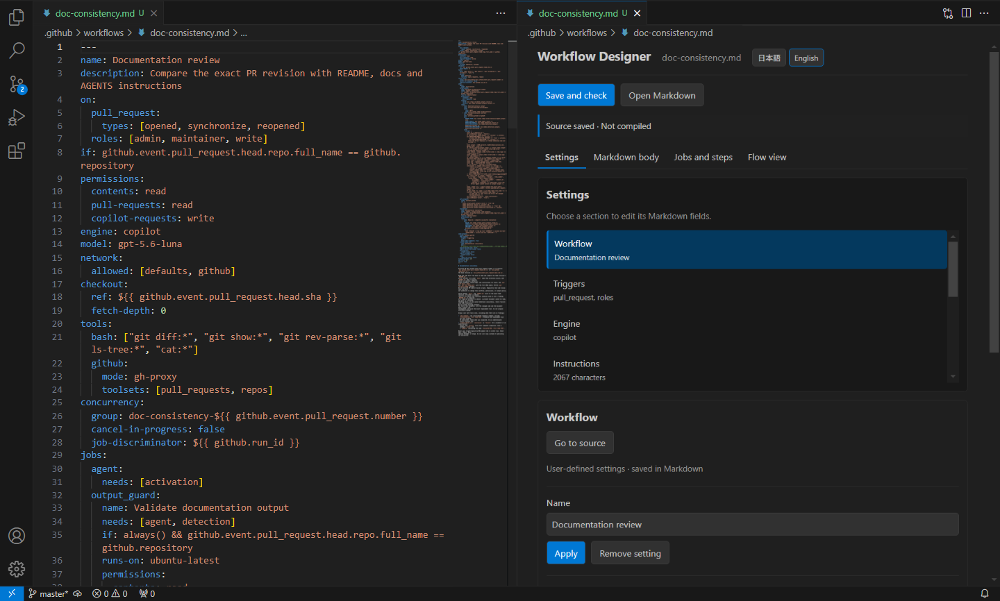
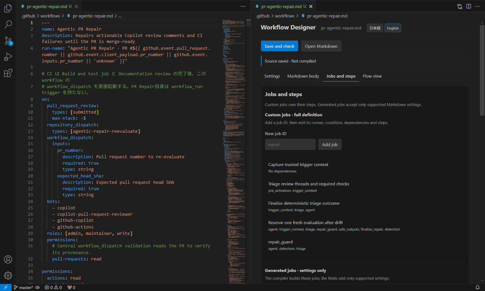

# Agentic Workflow Designer

[English](README.md)

GitHub Agentic WorkflowsのMarkdown編集を支援する非公式のVS Code拡張です。設定・本文の見出し・ジョブを一覧から選び、標準のMarkdownエディターと並べて編集できます。Markdownを正本として扱います。GitHubによる公式提供や承認を受けた拡張ではありません。

## 導入

Windows 11、デスクトップ版VS Code 1.96以降、ローカルのGitリポジトリ、GitHub CLI、`gh aw`拡張が必要です。CLIの版を固定せず、インストール済みの版でコンパイルします。

GitHub CLIは[公式手順](https://cli.github.com/)で導入してください。gh-awは利用者が最新版をインストールします。

```powershell
gh extension install github/gh-aw
gh aw version
```

公開後はVS Codeの拡張機能画面で「Agentic Workflow Designer」を検索してインストールできます。GitHub Releaseから`gh-aw-visual-editor-0.1.0.vsix`をダウンロードし、「拡張機能: VSIXからのインストール」で導入する方法もあります。リポジトリのフォルダーを開き、「Agentic Workflows: 環境を確認」を実行してください。拡張がツールを自動で導入・更新することはありません。GitHubで実行する際の認証やEngineの資格情報は、別途設定が必要です。

## 使い方

初めて作る場合は、[新規作成から進める練習手順](docs/first-workflow.ja.md)を参照してください。リポジトリを調査して改善レポートを作る題材で、指示・設定・生成ジョブを一通り確認できます。

[2つのAWサンプル](sample/README.md)も同梱しています。ほかのリポジトリで使う前に、参照先のスクリプトや権限を確認してください。



Documentation reviewのサンプルでは、Markdownと設定画面を並べて確認できます。



Agentic PR Repairのサンプルでは、独自ジョブと依存先を確認できます。

「Agentic Workflows: Workflowを新規作成」から、テンプレートとファイル名を指定します。最小ひな形、リポジトリ調査、Issue整理、定期レポート、既存文書の複製を選べます。ファイル名に`.md`は不要です。複数フォルダーを開いている場合は保存先を選びます。`.github/workflows/`に作成し、既存ファイルは上書きしません。

既存ファイルはExplorerで右クリックし、「デザイナーを開く」を選択します。GUIと標準のMarkdownエディターが並びます。GUIで「適用」するとMarkdownに反映され、Markdownを直接編集した場合もGUIへ同期します。このメニューと右上のボタンは`.github/workflows/`配下のMarkdownに表示され、デザイナーがアクティブな間は右上のボタンを隠します。ほかの場所にある文書はコマンドパレットから開けます。

| 表示 | できること |
|---|---|
| 設定 | 項目の一覧から選び、Trigger、Engine、Tools、Permissions、Safe Outputsなどを編集します。 |
| 本文 | 見出しを一覧から選び、タイトルと本文を編集します。書式ボタン、見出しの追加・並べ替え・削除も使えます。 |
| ジョブとステップ | 独自ジョブは名前・実行環境・依存先・ステップまで作成できます。自動生成ジョブには対応する条件・追加依存先・権限・制限時間・ステップを設定できます。 |
| フロー図 | Markdownに明示されたジョブの依存関係と、gh-aw標準ジョブの予想を縦向きに表示します。ジョブを選ぶと編集欄に移動します。破線は確認済みのコンパイル動作から推定した部分です。 |

まず「本文」でエージェントにさせたい作業を書き、「指示を適用」を押します。横のMarkdownで変更を確認してから「保存して確認」を押します。公式CLIが生成したYAMLを詳しく見る場合は、コマンドパレットの「生成YAMLを開く」を使います。固定コマンドやActionには「ジョブとステップ」の独自ジョブを使います。`jobs:`やジョブ名にMarkdown側のカーソルを置くと、対応するジョブの編集画面が開きます。エージェントやSafe Outputsなどの自動生成ジョブでは、対応する設定だけを追加できます。Safe Outputsの機能設定へも、そのジョブの画面から移動できます。

`uses:`を指定したActionステップを選ぶと、`with:`の入力値を名前ごとに追加・変更・削除できます。文字列・数値・真偽値を選べます。既存の再利用Workflowジョブでも同じ欄を表示します。複雑な構造は該当するMarkdownへ移動して編集します。

自動生成ジョブに追加する依存先・条件・権限は、CLIが作る値に加算・結合されます。生成ジョブ自体や必須の依存先を置き換えるものではありません。`setup-steps`は`activation`と`pre_activation`には追加できず、通常の`steps`も対応ジョブだけに表示します。最後のコンパイル結果に存在しない生成ジョブを設定すると、機能やトリガーの有効化が必要になる場合があります。保存してコンパイルし、実際に生成されたジョブで確認してください。

指示の手順はエージェントに渡す文章の順序です。個々の指示をActionsの独立したジョブとして実行するものではありません。この拡張はGitHub上の実行状況を表示しません。ソース変更後は再確認してください。

ジョブ一覧では、ステップまで編集できる「独自ジョブ」と、対応する設定だけを追加できる「自動生成ジョブ」を分けて表示します。importsは参照として扱います。コマンドパレットから開く生成結果は閲覧用です。

各フォームは「適用」で文書に反映します。「ソースへ移動」「Markdownを開く」は、並んでいる標準エディターを再利用します。GUIとソースは同じ文書とUndo/Redoの履歴を共有します。Markdownでカーソルを動かすと、GUIも対応する設定や本文を選びます。未適用の入力中はカーソルに追従しません。新規作成、生成YAML、環境確認はコマンドパレットから使えます。

Ctrl+SではMarkdownだけを保存します。「保存して確認」は対象と必要な依存ファイルを保存して、リポジトリ内で公式CLIを実行します。進行通知から中止できます。コマンドパレットの「生成YAMLを開く」では現在の生成物、最後の正常生成物、実行前の退避を読み取り専用で開けます。読み取り用の文書を別名で保存しても、元のlockファイルは更新されません。

フォームでは、名前・説明、手動・Issue・PR・cronのトリガー、Engineとモデル、GitHub・bash・editツール、明示的な権限、4種類のSafe Outputs、ネットワークの許可先、制限時間を編集できます。Issue・PRのイベント、Engine、GitHub toolsets、コメントの対象、ネットワークの許可先には候補があります。候補を選んで追加し、「適用」でMarkdownに反映します。固有のラベルやドメインなどは直接入力できます。機能を無効にすると、その子項目は隠れます。

GUIに未対応の項目は「その他の設定」に名前を表示します。「Markdownで編集」でその行へ移動でき、JSON全体を読む必要はありません。alias、merge、コメント付きコレクション、複数行文字列など、安全に変更できない形式にもソース編集のボタンを表示します。[対応範囲](docs/compatibility.md)と[制約](docs/limitations.md)も参照してください。

言語設定がない場合、画面はVS Codeの表示言語に従います。デザイナー上部には「日本語」「English」の2つのボタンがあり、再読み込みせずに切り替えられます。選択はユーザー設定`ghAwDesigner.language`に保存されます。再びVS Codeの表示言語に合わせるには、この設定を既定値に戻します。未適用のフォーム入力やMarkdownは切り替えても変わりません。コマンドパレットや右クリックメニューなど、VS Codeが表示するコマンド名は引き続きVS Codeの言語に従います。配色、フォーカス表示、入力欄のラベルもVS Codeの利用環境に合わせています。`on`がない共有コンポーネントは編集できますが、単独ではコンパイルせず、参照元のWorkflowからコンパイルします。

## 生成物の状態と信頼

ソースの保存とコンパイルの状態を分けて表示します。設定変更、本文だけの変更、依存変更、処理中、失敗、処理中の再編集を区別します。正常コンパイルの記録がない既存lockファイルは「対応状態未確認」です。開き直した際には記録したハッシュを現在のファイルと比較します。リモート参照は未展開であり、最新状態を検証済みとは表示しません。

同名の`.lock.yml`があれば、拡張の成功記録と一致しなくても「生成YAMLを開く」から閲覧できます。この場合は「lock YAMLあり・拡張の成功記録とは不一致（対応未確認）」と表示し、ファイル不在とは区別します。正常にコンパイルした際のCLI版も記録します。

CLIはシェルを介さず、`gh aw compile --json --no-check-update <ソース>`を実行します。lock YAMLのほか、`.gitattributes`、`.github/aw/actions-lock.json`、高度な設定に必要な補助ファイルを変更する場合があります。生成物や補助ファイルが未保存の場合、または監視開始後に外部で変更された場合は実行を止めます。変更を確認し、ワークスペースを開き直してから再実行してください。

失敗してもリポジトリ内の変更を自動では戻しません。最後の正常生成物はVS Codeの拡張保存領域に残します。リポジトリ全体の原子的な更新や、バックアップ・バージョン管理の代替は保証しません。

未信頼ワークスペースでも編集できますが、環境確認を含め外部コマンドは実行しません。拡張は`init`、`fix`、`approve`、Git操作、Workflow実行を行わず、独自サービスに本文を送信しません。公式CLIが依存の取得などでネットワークを使う場合はあります。コンパイル成功は、GitHubでの実行成功や安全性の承認を意味しません。

MITライセンスです。[サードパーティーのライセンス](THIRD_PARTY_NOTICES.md)を同梱しています。
