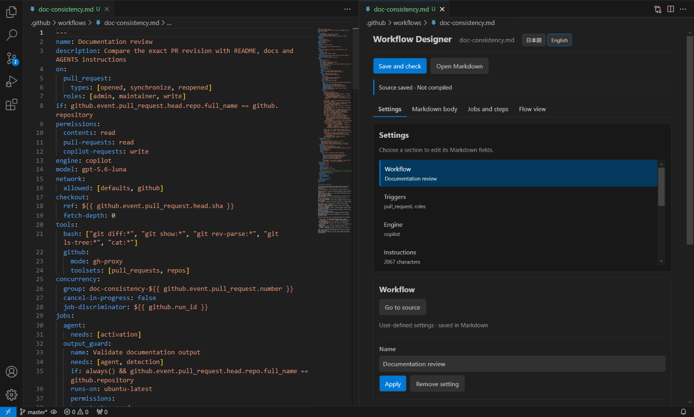
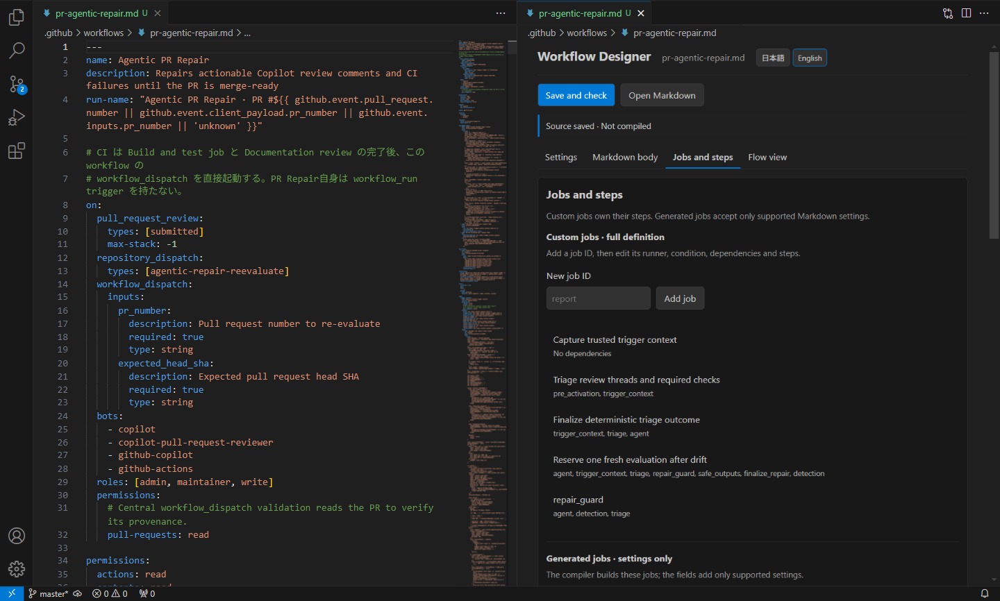

# Agentic Workflow Designer

[日本語](README.ja.md)

An **unofficial** VS Code helper for editing GitHub Agentic Workflows Markdown. It shows settings, instruction headings, and jobs beside the native Markdown editor. The source document remains authoritative. This extension is not affiliated with or endorsed by GitHub.

## Install

Requires Windows 11, desktop VS Code 1.96 or later, a local Git repository, GitHub CLI, and the `gh aw` extension. Compilation uses the installed CLI without an exact version gate.

Install GitHub CLI using its [official installation instructions](https://cli.github.com/). Install the latest workflow extension yourself:

```powershell
gh extension install github/gh-aw
gh aw version
```

Install **Agentic Workflow Designer** from the VS Code Extensions view. Alternatively, download `gh-aw-visual-editor-0.1.1.vsix` from a GitHub Release and use **Extensions: Install from VSIX…**. Open your local repository folder, then run **Agentic Workflows: Check Environment**. The editor never installs or updates tools automatically. GitHub authentication and engine credentials are separate prerequisites for running a workflow on GitHub.

## Use

For a step-by-step walkthrough, see [First workflow practice (Japanese)](docs/first-workflow.ja.md), which covers instructions, settings, and generated jobs while building a repository improvement report.

Run **Agentic Workflows: New Workflow**, select a template, and enter a file name without `.md`. Templates cover a minimal workflow, repository investigation, issue triage and scheduled reports. You can also duplicate an existing Markdown document. Files are created under `.github/workflows/` without overwriting existing files. Multi-folder workspaces prompt for the destination.

Two [sample workflows](sample/README.md) are included for inspection. They reference repository-specific automation and need review before use elsewhere.



The Documentation review sample shows the source and settings side by side.



The Agentic PR Repair sample shows custom jobs and their dependencies.

Right-click a Markdown file under `.github/workflows/` and choose **Open Designer**. The GUI and native Markdown editor open side by side. Apply changes in the GUI to update Markdown, or edit Markdown directly to refresh the GUI. The menu appears only for Markdown in that standard AW location; the title action is hidden while the designer is active. Use the command palette for documents elsewhere.

| View | Use |
|---|---|
| Settings | Choose a configuration section and edit triggers, engine, tools, permissions, safe outputs and other fields. |
| Markdown body | Add, edit, reorder or delete prompt sections and inline agent/skill definitions. Insert imports, run information and conditional prompts. |
| Jobs and steps | Create custom jobs and steps, or add supported Markdown settings to compiler-generated jobs. |
| Flow view | See declared job dependencies and expected gh-aw jobs in a vertical diagram. Select a job to open its editor. Dashed elements are inferred from observed compiler behavior, not confirmed execution. |

Start in **Markdown body**, write the agent's instructions and choose **Apply instructions**. The Markdown beside the helper updates immediately. **Save and check** saves the source and runs the official compiler. Use **Jobs and steps** for fixed commands or Actions. Placing the Markdown cursor on `jobs:` or a job name opens the corresponding editor. A custom `report` job can define its runner, dependencies and complete steps. Generated jobs such as `agent` and `safe_outputs` expose supported additions and a route to their feature settings; the compiler still creates the job and retains its required dependencies. Use **Agentic Workflows: Open Generated YAML** from the command palette when you need to inspect the compiler output.

Select an Action step with `uses:` to edit its `with:` inputs by name. Text, number, and boolean values can be added, changed, and removed. Existing reusable-workflow jobs with `uses:` expose the same input editor. Complex input structures lead to the matching Markdown source.

Added dependencies, conditions, and permissions on generated jobs are combined with compiler-generated values rather than replacing the job or its required dependencies. `setup-steps` cannot be added to `activation` or `pre_activation`, and ordinary `steps` are shown only on supported jobs. If you configure a generated job not present in the last compiled result, enabling its trigger or feature may be required. Save and compile to verify against the actually generated jobs.

Instruction sections describe the order requested of the agent; they are not independent Actions jobs. The helper does not show a live GitHub run. Check again after source changes.

### Prompt assistance

Choose **Edit instructions and definitions** on the generated `agent` job. In **Markdown body**, open **Add section or definition** and choose a prompt section, sub-agent or inline skill. Enter its name and instructions. Sub-agents accept optional description and model fields; inline skills accept description. Existing definition YAML remains editable in the text area, preserving authored fields. Definitions are listed separately from normal sections and can be renamed, reordered or deleted.

| Item | Helper and behavior |
|---|---|
| Prompt section | Enter a section title and instructions. |
| Sub-agent | Add a ``## agent: `reviewer` `` definition and matching end marker. Accepts optional `description` and `model`. |
| Inline skill | Add a ``## skill: `review-checklist` `` definition and matching end marker. The YAML frontmatter supports `description`. |
| Formatting / examples | Insert checklists and expected output example blocks. |
| External content | Insert `{{#runtime-import .github/rules.md}}`. Supports public HTTP(S) URLs, line ranges, and optional skipping when missing. |
| Run information | Select repository, actor, Issue or PR number, and insert in `${{ github.repository }}` format. |
| Conditional prompt | Wrap selected text in `{{#if ...}}` and `{{/if}}` for Issue, PR, or manual-run conditions. |

**Insert into instructions** provides checklists, output examples, `${{ ... }}` run information, file/URL runtime imports, optional imports and line ranges. Select text to wrap it in an Issue, pull request or manual-run condition. Insertions stay in the draft until **Apply instructions**; apply pending instructions before adding another section or definition.

Definitions use matching `## end agent:` / `## end skill:` markers so nested `##` headings remain inside their definition. gh-aw extracts definitions from the parent prompt at runtime. Ask the parent to use the named agent or skill; defining one does not invoke it. Models and invocation behavior depend on the engine. See the [inline sub-agent reference](https://github.github.com/gh-aw/reference/inline-sub-agents/) and [inline skill implementation](https://github.com/github/gh-aw/blob/v0.89.21/actions/setup/js/extract_inline_skills.cjs).

Runtime-import files must stay inside `.github`; public HTTP(S) URLs are also supported. Conditions do not support nesting or `else`. Prompt expressions cannot access secrets or environment variables. Edit advanced expressions in Markdown and validate them with the installed CLI. See [Templating](https://github.github.com/gh-aw/reference/templating/).

The jobs list separates **custom jobs** from **generated jobs**. Custom jobs own their steps; generated jobs accept only supported source settings. Imports remain references. Compiled output opens read-only from the command palette.

Apply each form explicitly. **Go to source** and **Open Markdown** reuse the visible Markdown editor. All sections share one document and Undo/Redo history. Moving the source cursor selects the corresponding helper section, except while a form has unapplied input. New Workflow, Open Generated YAML, and Check Environment remain available from the command palette.

**Ctrl+S saves Markdown only.** Choose **Save and check** to save the target, resolve unsaved local dependencies, and run the official compiler in the repository. Progress can be cancelled. **Open Generated YAML** opens a read-only snapshot of the current output, last successful output, or pre-compile backup. Saving an output snapshot requires an explicit Save As; it does not edit the repository's lock file.

Forms cover metadata; manual, issue, PR and cron triggers; engine/model; GitHub, bash and edit tools; explicit permissions; four safe output types; allowed network destinations; and timeouts. Pick suggestions for Issue/PR events, engine IDs, GitHub toolsets, comment targets and network ecosystems, then Apply. Custom values remain editable. Disabling a feature hides its dependent fields.

Unsupported fields appear by name under **Additional settings**, with **Edit in Markdown** opening the matching source line instead of a JSON dump. Unsafe forms such as aliases, merges, commented collections and multiline scalars also offer source navigation. See [compatibility](docs/compatibility.md) and [limitations](docs/limitations.md).

With no language preference set, the designer follows VS Code's display language. The two buttons at the top switch to **日本語** or **English** immediately, preserving unapplied form input and Markdown. The choice is saved in the user setting `ghAwDesigner.language` (`ja` or `en`); reset that setting to its default to follow VS Code again. Command-palette and context-menu titles remain in VS Code's own display language. The UI uses VS Code theme colors, visible keyboard focus and labelled inputs. Shared components without `on` can be edited, but are compiled through an importing workflow.

## Output state and trust

Source save status is distinct from compile status. The editor distinguishes configuration changes, instruction-only changes, dependency changes, compilation, failures and edits during compilation. A pre-existing lock file without a successful record is unverified. On reopening the workspace, saved hashes are compared with current files. Remote imports remain unexpanded and are not claimed to be freshly verified.

An existing sibling `.lock.yml` remains viewable even when it differs from the extension's last successful record. The status says that correspondence is unverified instead of reporting a missing output. The compiler version used for each successful build is retained with that record.

Compilation uses `gh aw compile --json --no-check-update <source>` without a shell. It can modify lock YAML, `.gitattributes`, `.github/aw/actions-lock.json`, and additional files for advanced configurations. Unsaved output/auxiliary documents and observed external output/auxiliary changes block compilation. Review those changes and reopen the workspace before trying again. Failure never automatically rolls back repository files. Last successful output remains in VS Code extension storage. This is not an atomic repository update or a replacement for backups and version control.

Untrusted workspaces support editing, but cannot run external commands, including environment probes. The extension does not run `init`, `fix`, `approve`, Git operations or GitHub workflows, and does not send prompts to an editor-operated service. The official CLI may use the network to resolve dependencies. Compile success does not establish runtime success or security approval.

MIT license. See [third-party notices](THIRD_PARTY_NOTICES.md).
